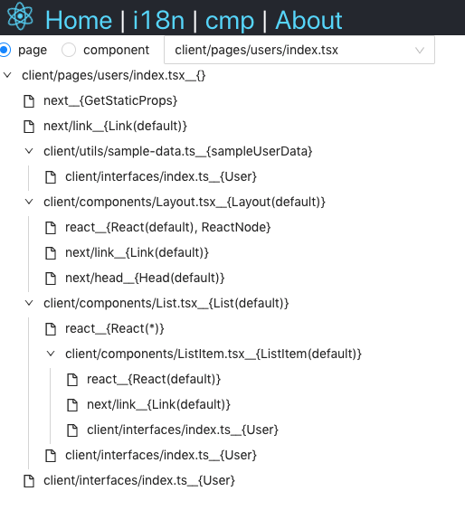

# next 依赖分析

基于 ast 的 next 依赖分析工具。

## 使用(调试方式)

项目添加了一个 next.js 官方提供的 typescript 模板项目作为参考。

首先再根目录下、app 目录下、server 目录下分别安装依赖。

打开`src/index.ts:12` 修改`devProjPath`变量为在你自己电脑的绝对路径

然后根目录下执行`yarn dev`，执行完毕后去 server 目录下`yarn dev`和 app 目录下`yarn dev`（这里起了两个 node，一个前端一个后端，注意后端一定要首先启动，启动完毕再去启动前端。发包之后只会起一个 node）

然后访问`http://localhost:3000`即可

## 使用(CLI 方式)

先全局安装下：`yarn global add next-analysis`

然后进入到 next 项目的更目录，执行`next-analysis run` 分析引用得到引用文件`next-analysis.json`

最后执行`next-analysis server`或者`next-analysis server -p 3000`（默认 8080 端口）

访问`localhost:8080`可以看到页面。`localhost:8080/api/json`可以看到接口

## 开发

```
▸  app/          前端代码
▸  bin/          cli入口
▸  server/       后端代码
▸  src/          cli引用分析代码
   package.json
   README.md
   tsconfig.json
   yarn.lock
```

1. 先分别在根目录、app 目录、server 目录跑一下`yarn`安装依赖
2. 核心代码在 src 下，打开`src/index.ts`修改`devProjPath`变量，改为自己系统中的 next 项目的绝对路径。在根目录执行`yarn dev`会分析代码产生`next-analysis.json`、`next-analysis.log`。主要是 json 文件，log 是给你看日志用的
3. server 是基于 nest.js 框架起的 node 服务，会读取上面生成的 json 文件，基于这份文件提供接口做些事情。controller 暴露接口，service 写逻辑代码。进入到 server 后执行`yarn dev`，访问`localhost:8080/api/json`可以看到输出（建议 Chrome 安装下 json 可视化插件）
4. app 是基于 react 的 UI 层，美化一下输出。用了 vite 打包。进入 app 后执行`yarn dev`，`打开localhost:3000`看效果
5. server 和 app 都会打包完复制到 dist 目录下。作为 cli 的一部分导出

## 发布

1. 根目录下 `yarn dist`，会分别执行根目录、server 目录、app 目录的 build
2. 修改`package.json`的`version`
3. `npm publish`

## 预览

以下内容对应的项目是根目录下的`next-demo`

整个项目的引用图结构，以 `client/pages` 为整个入口


`client/pages/users/index.tsx`引用的组件树


`client/interface/index.tsx`的`User`被引用结构，多层分析，一直到page终止

